# GitBook 다국어 설정 가이드 (한국어/영어)

## 개요

하나의 GitHub repo에서 한국어와 영어 두 가지 언어로 GitBook 문서를 제공하는 방법.

### 최종 구조

```text
Docs site: K8S Operator (1개)
  ├── Korean variant (Space: Docs)       -> GitHub repo ./ko/
  └── English variant (Space: Untitled)  -> GitHub repo ./en/

같은 repo (operator-study), 같은 branch (main), 다른 project directory
```

### 최종 URL

| 언어          | URL                                             |
| ------------- | ----------------------------------------------- |
| 한국어 (기본) | `https://teamsmiley.gitbook.io/k8s-operator/`   |
| 한국어        | `https://teamsmiley.gitbook.io/k8s-operator/ko` |
| 영어          | `https://teamsmiley.gitbook.io/k8s-operator/en` |

---

## 1단계: GitHub repo 구조 변경

기존 `notes/` 폴더를 `ko/`로 이동하고, 영어 번역 `en/` 폴더를 추가한다.

### 변경 전

```text
Operator/
  Readme.md
  SUMMARY.md
  notes/
    00-environment-setup.md
    01-CRD와-CR.md
    ...
```

### 변경 후

```text
Operator/
  ko/
    Readme.md
    SUMMARY.md
    notes/
      00-environment-setup.md
      01-CRD와-CR.md
      ...
  en/
    Readme.md
    SUMMARY.md
    notes/
      00-environment-setup.md
      01-crd-and-cr.md
      ...
```

### 명령어

```bash
# ko 폴더 생성 및 파일 이동 (git 히스토리 보존)
mkdir -p ko en/notes
git mv Readme.md ko/
git mv SUMMARY.md ko/
git mv notes ko/

# 영어 번역 파일 생성 (en/ 폴더에)
# ... 번역 파일 작성 ...

git add en/
git commit -m "ko/en 다국어 구조로 변환"
git push
```

### SUMMARY.md

각 언어 폴더에 `SUMMARY.md`가 있어야 GitBook 사이드바가 구성된다.

`ko/SUMMARY.md` 예시:

```markdown
# Table of contents

- [K8S Operator](Readme.md)

## Phase 1: 환경 구성 + 기초 개념

- [환경 설정 (Go, Docker, k3d, kubebuilder)](notes/00-environment-setup.md)
- [CRD와 CR](notes/01-CRD와-CR.md)
  ...
```

`en/SUMMARY.md` 예시:

```markdown
# Table of contents

- [K8S Operator](Readme.md)

## Phase 1: Environment Setup + Basics

- [Environment Setup (Go, Docker, k3d, kubebuilder)](notes/00-environment-setup.md)
- [CRD and CR](notes/01-crd-and-cr.md)
  ...
```

---

## 2단계: GitBook 초기 설정

### GitBook에서 Space 생성 및 GitHub 연결

GitBook.com에서 Space를 생성하고 GitHub repo를 연결하면, 기본적으로 repo 루트를 읽는다.

SUMMARY.md가 없으면 사이드바에 폴더만 보인다:

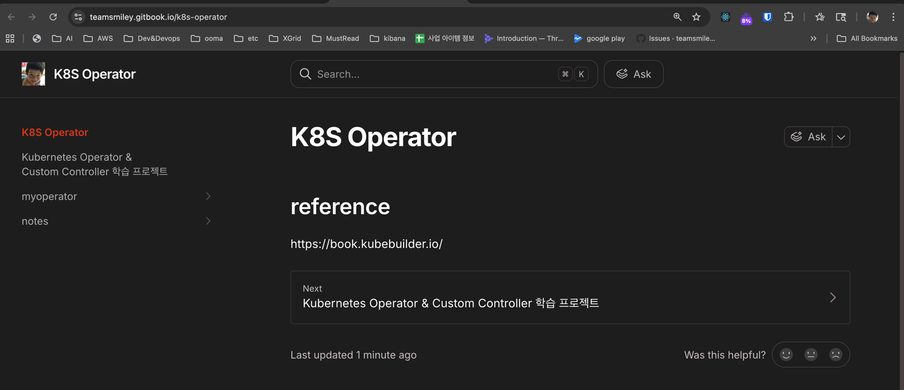

SUMMARY.md를 추가하면 사이드바가 정리된다:

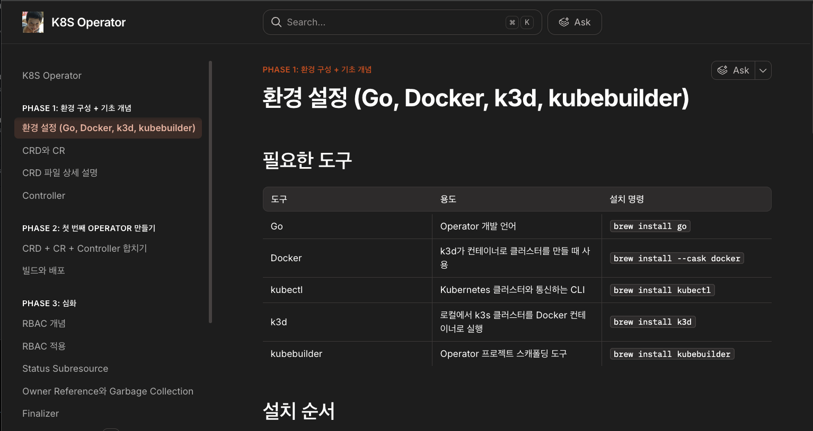

---

## 3단계: Docs site 구조 이해

GitBook에는 **Space**와 **Docs site** 두 개념이 있다.

| 개념      | 역할                                    | 비유      |
| --------- | --------------------------------------- | --------- |
| Space     | 실제 문서가 들어있는 곳 (Git repo 연결) | 원고      |
| Docs site | Space를 공개 URL로 발행하는 곳          | 출판된 책 |

왼쪽 메뉴에서 확인할 수 있다:

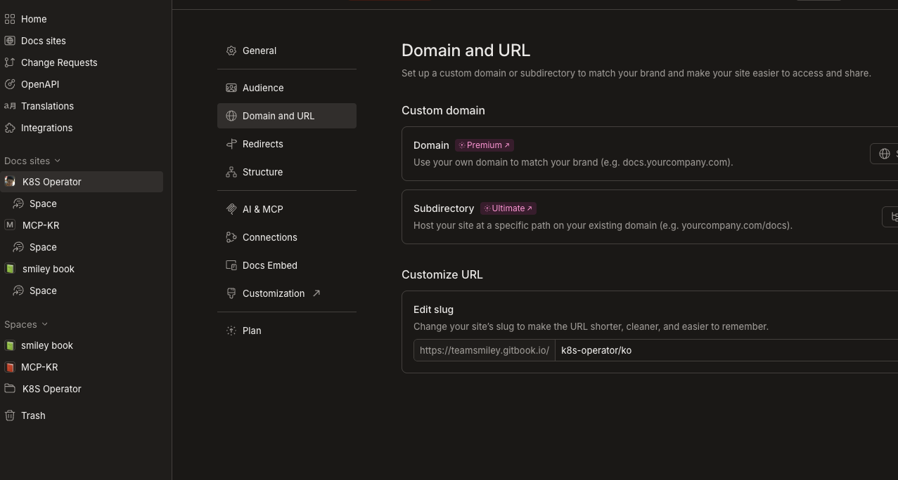

### K8S Operator 컨텍스트 메뉴

Docs site 옆의 점 세 개(`:`)를 클릭하면 메뉴가 보인다.
여기에는 Variant 옵션이 없다 (Structure 설정에서 관리).

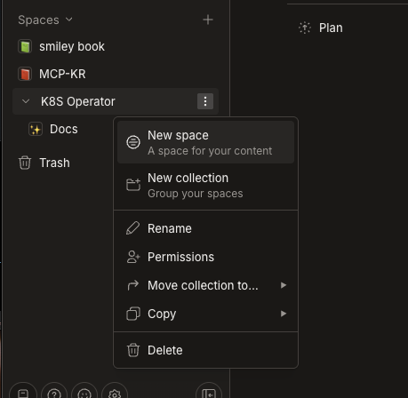

---

## 4단계: Domain and URL 설정

Docs site 설정 > Domain and URL에서 slug을 설정한다.

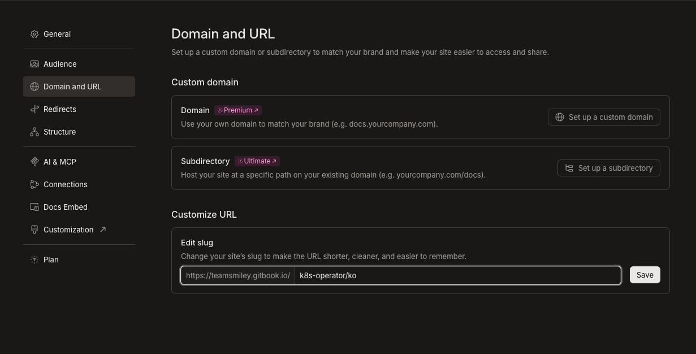

### slug에 `/` 사용 불가

`k8s-operator/ko`처럼 슬래시를 넣으면 에러가 발생한다.
GitBook이 `k8s-operator-ko`로 변경을 제안한다.

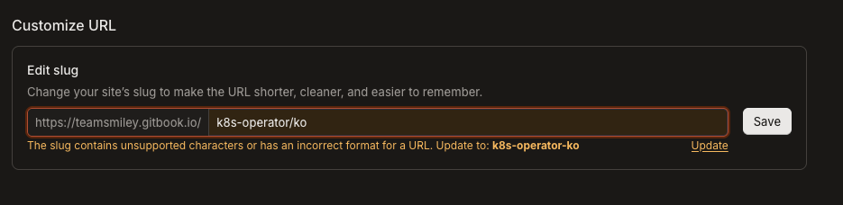

slug은 Docs site 전체의 URL이므로, 언어 구분은 slug이 아니라 **Variant**로 한다.
slug은 `k8s-operator`로 설정한다.

---

## 5단계: Git Sync에서 Project directory 설정

repo 루트가 아닌 특정 폴더를 바라보게 하려면, Git Sync 설정에서 **Project directory**를 지정해야 한다.

설정하지 않으면 repo 루트의 CLAUDE.md가 메인 페이지로 보인다:

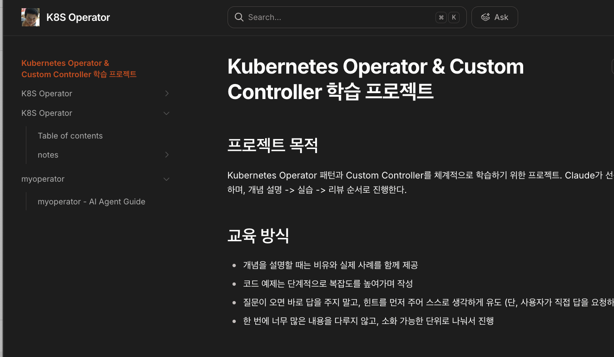

---

## 6단계: Variant 추가 (다국어 설정)

### Structure 페이지

Docs site 설정 > Structure에서 **"Add variant"** 버튼을 찾는다.

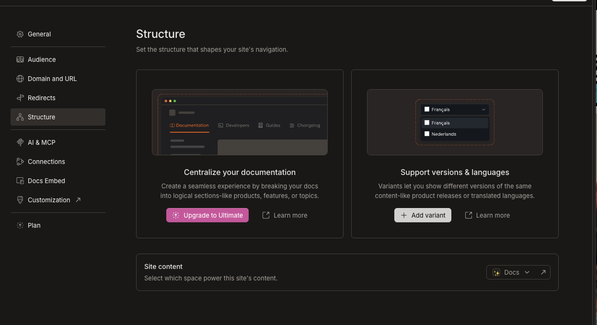

### Variant 생성

"Add variant" 클릭 시 옵션이 나온다:

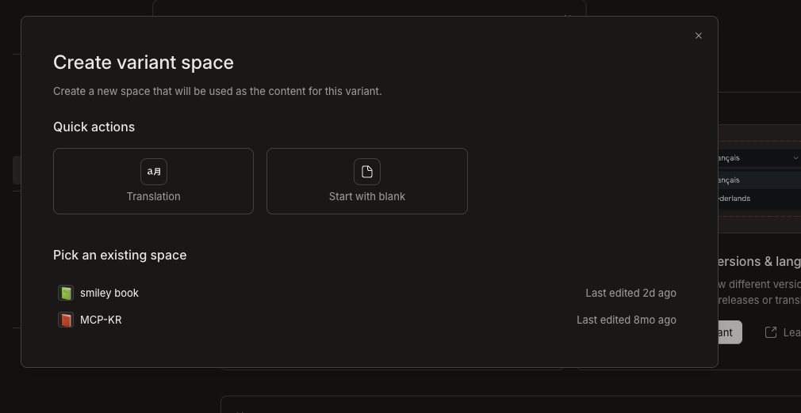

| 옵션                   | 용도                                               |
| ---------------------- | -------------------------------------------------- |
| Translation            | GitBook AI가 자동 번역 (번역이 이미 있으면 불필요) |
| Start with blank       | 빈 Space 생성 (직접 Git 연결)                      |
| Pick an existing space | 기존 Space 사용                                    |

이미 영어 번역 파일이 있으므로 **"Start with blank"** 를 선택한다.

### Translation 옵션 (참고)

Translation을 선택하면 GitBook AI가 자동 번역해주는 화면이 나온다.
번역이 이미 완료되어 있으면 이 기능은 불필요하다.

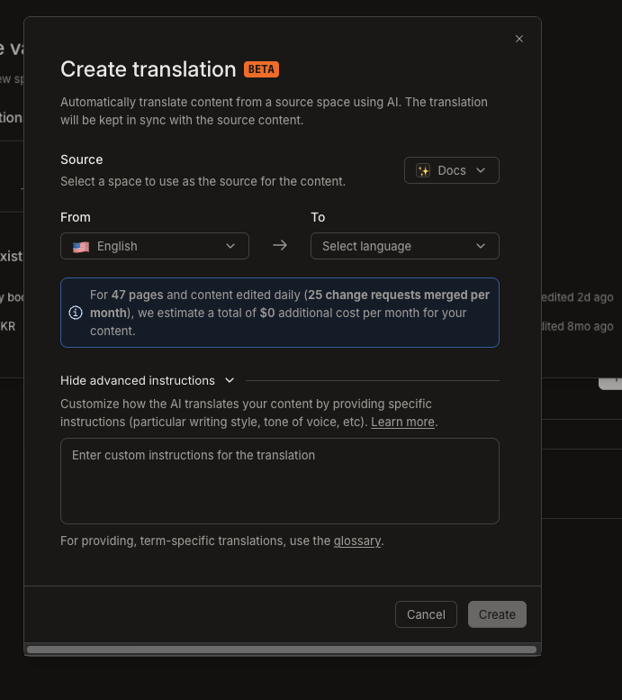

### Variant 설정

Start with blank 후 Title을 입력한다:

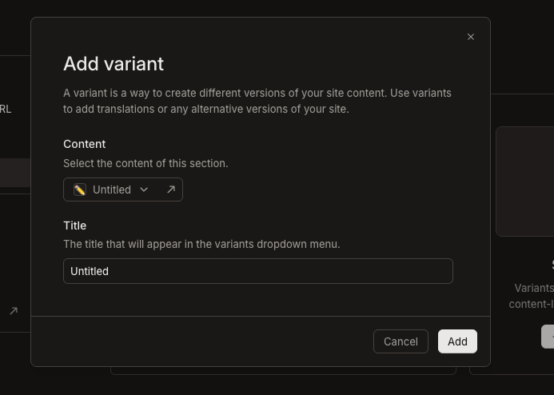

---

## 7단계: Korean / English Variant 설정

### Structure tree 확인

Variant가 추가되면 Structure tree에 두 항목이 보인다:

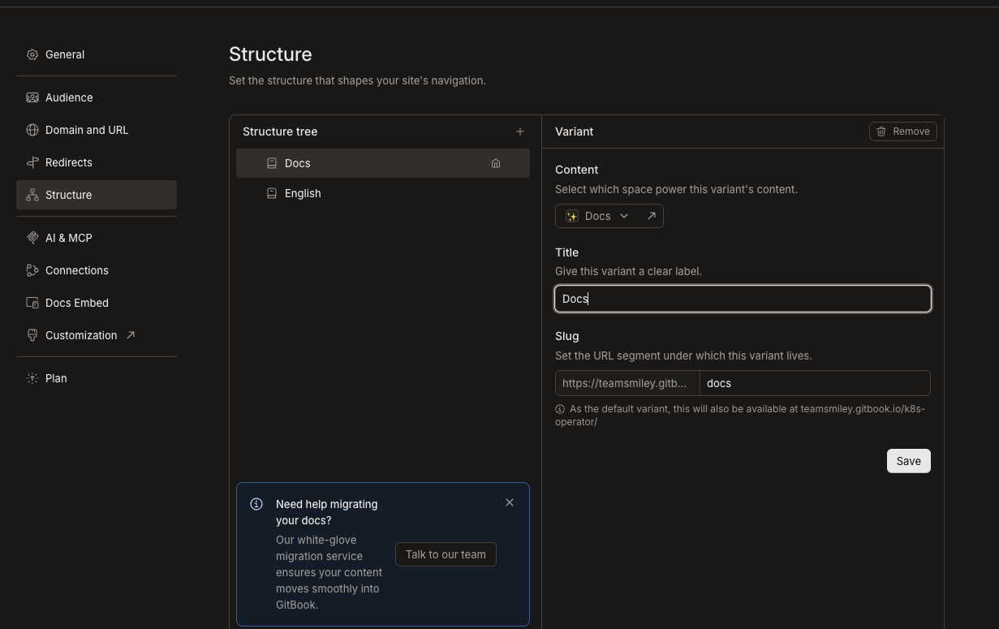

### Korean variant 설정

- Title: **Korean**
- Slug: **ko**
- Content: **Docs** (기존 Space)

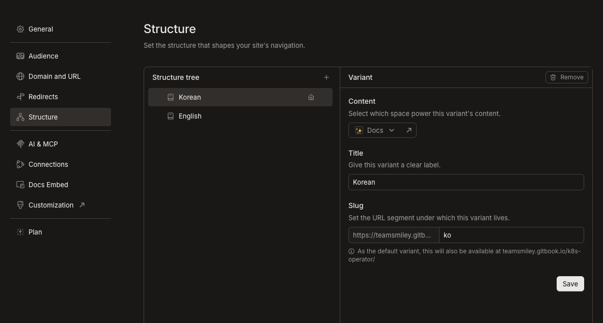

### English variant 설정

- Title: **English**
- Slug: **en**
- Content: **Untitled** (새로 생성된 빈 Space)

Content Space 선택 시 드롭다운에서 적절한 Space를 선택한다:

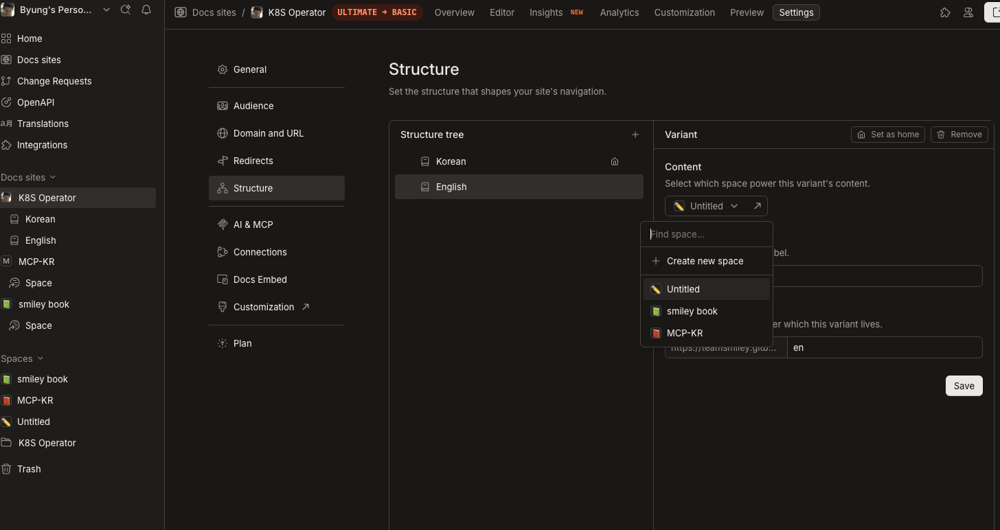

---

## 8단계: 각 Space에 Git Sync 연결

각 variant의 Content Space에 Git Sync를 설정한다.
같은 repo, 같은 branch, 다른 **Project directory**.

### Korean Space (Docs)

- Repository: `operator-study`
- Branch: `main`
- Project directory: **`./ko/`**

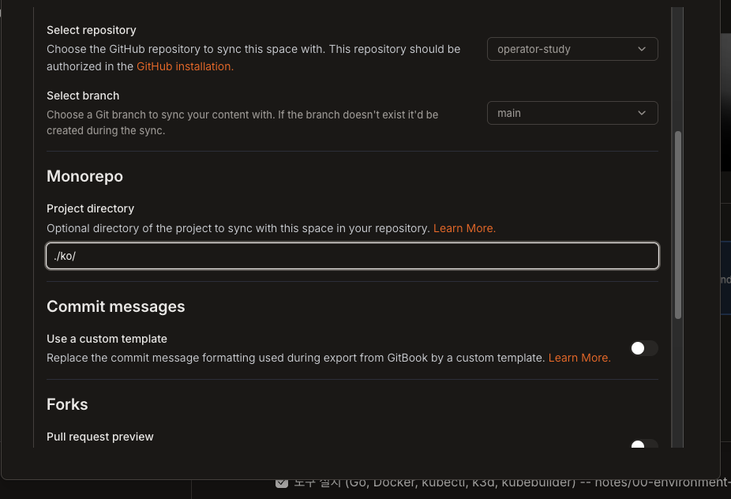

### English Space (Untitled)

- Repository: `operator-study`
- Branch: `main`
- Project directory: **`./en/`**

(같은 방식으로 설정)

---

## 최종 확인

### GitBook 설정 요약

| 항목              | Korean variant | English variant |
| ----------------- | -------------- | --------------- |
| Title             | Korean         | English         |
| Slug              | ko             | en              |
| Content Space     | Docs           | Untitled        |
| Git repo          | operator-study | operator-study  |
| Branch            | main           | main            |
| Project directory | `./ko/`        | `./en/`         |

### 독자가 보는 화면

독자는 GitBook 페이지 상단의 드롭다운에서 Korean / English를 전환할 수 있다.

---

## 주의사항

1. **SUMMARY.md 필수**: 각 언어 폴더에 `SUMMARY.md`가 있어야 사이드바가 구성된다
2. **Project directory 형식**: `./ko/` 처럼 `./` 접두사와 `/` 접미사를 포함해야 한다
3. **slug에 슬래시 불가**: Docs site slug에는 `/`를 사용할 수 없다 (variant slug으로 언어 구분)
4. **Git Sync 방향**: GitBook에서 편집하면 GitHub에 push되고, GitHub에서 push하면 GitBook에 반영된다 (양방향)
5. **Untitled Space 이름**: English variant의 Content Space 이름("Untitled")은 나중에 변경 가능하다
